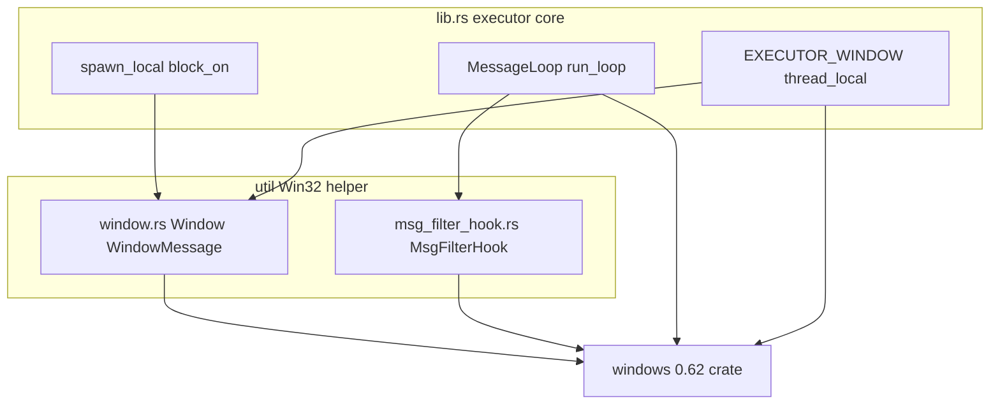
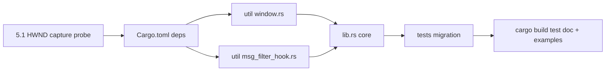

# Technical Design: windows-crate-migration

## Overview

本設計は `wintf-winmsg-executor` の Win32 バインディングを `windows-sys`（0.61 系）から `windows`（0.62 系）へ移行する、**挙動非変更の内部リファクタリング**を定義する。対象は `Cargo.toml` と 3 つのソースファイル（`src/lib.rs`、`src/util/window.rs`、`src/util/msg_filter_hook.rs`）およびそれらのテストモジュールである。新規コンポーネント・新規ファイルは一切導入しない。

既存の 2 層アーキテクチャ（executor コア / Win32 ヘルパー）、依存方向、公開 API の構造・契約を保ち、Win32 FFI 層の実装のみを `windows` newtype・`Result`・RAII へ置き換える。あわせて文字列を扱う API を A 系（ANSI）から W 系（Unicode）へ全面的に切り替える。

**Users**: 本クレートの保守担当者は型安全な newtype と慣用的エラーハンドリングの恩恵を受ける。本クレートの利用者は観測可能な挙動が不変であることの保証を受ける。
**Impact**: Win32 FFI 層の実装を置換する。公開型（`WindowMessage` のフィールド、`Window::hwnd()` の戻り値）が `windows` newtype に変わるため SemVer 上の破壊的変更となる（現行 0.0.x ゆえ許容、文書化する）。

### Goals
- `windows_sys::` 参照ゼロ化、`windows = "0.62"` への全面置換、`cargo build`/`test`/`doc` および両 examples ビルドの成功（1.x, 3.x）。
- メッセージループ・wake・モーダル対応・パニック持ち回りの観測挙動の完全維持（既存テスト全パス）（2.x）。
- W 系（Unicode）全面化、`windows` newtype の公開、慣用イディオムによる行数非膨張（4.x, 7.x）。

### Non-Goals
- 機能追加・挙動変更・パフォーマンス最適化。
- `windows` の高水準（安全）ラッパへの書き換え。
- `async-task` の利用方法の変更、executor の非同期セマンティクス変更。
- `examples` 本体ロジックの変更（ビルド成功のみを保証）。

## Boundary Commitments

### This Spec Owns
- `Cargo.toml` の `windows` 依存宣言と features セット。
- `src/lib.rs`・`src/util/window.rs`・`src/util/msg_filter_hook.rs` の Win32 FFI 実装移行（各テストモジュール含む）。
- 公開型（`WindowMessage`、`Window::hwnd()` 等）を `windows` newtype として露出する方針。

### Out of Boundary
- executor の非同期セマンティクス・wake 機構・`WH_MSGFILTER` モーダル対応ロジック（型置換以外の変更）。
- `async-task` の使用方法（`spawn_unchecked` の契約・schedule クロージャの設計）。
- `examples/basic.rs`・`examples/threads.rs` の本体ロジック（ビルド成功のみ保証）。
- README / steering の大幅改訂（移行に伴う最小限の記述更新は別途 `kiro-complete` で実施）。

### Allowed Dependencies
- `windows = "0.62"`（features: `Win32_Foundation`、`Win32_UI_WindowsAndMessaging`、`Win32_System_Threading`、`Win32_Graphics_Gdi`）。
- `async-task = "4.7"`（`default-features = false`、不変）、Rust `std`。
- **依存方向**: `lib.rs`（executor コア）→ `util`（Win32 ヘルパー）。逆方向参照は禁止。移行で不変。

### Revalidation Triggers
- 公開型（`WindowMessage` のフィールド型、`Window::hwnd()` 戻り型、`WindowType`/`WindowCreationError` 等）のシグネチャ変更 → 利用者の再検証。
- features セットの変更。
- `windows` のメジャーバージョン変更、または MSRV の変更。

## Architecture

### Existing Architecture Analysis
- **2 層構成**: `src/lib.rs`（executor コア。thread-local な `EXECUTOR_WINDOW`/`PANIC_PAYLOAD`、`MessageLoop`、`spawn_unchecked_lifetime`）が、`src/util/`（`window.rs` のウィンドウ生成・wndproc 補助、`msg_filter_hook.rs` のモーダルフック）に依存する。
- **保持すべきパターン**: RAII（`Window<S>::drop`→`DestroyWindow`、`MsgFilterHook::drop`→`UnhookWindowsHookEx`）、thread-local 状態集約、関数契約による unsafe 境界の表現（`spawn_unchecked_lifetime` を `spawn_local`/`block_on` が安全にラップ）、SAFETY コメント慣習。
- **移行の性質**: 上記の構造・依存方向・契約はすべて不変。各ノードの**内部実装（FFI 呼び出しと型）のみ**を置換する。

### Architecture Pattern & Boundary Map

- **Selected pattern**: 既存の階層型（executor core → Win32 helper → バインディング）を維持。移行は最下層のバインディングを `windows-sys` から `windows` へ差し替えるのみ。
- **Existing patterns preserved**: 2 層分離、RAII、thread-local 集約、生 Win32 直接呼び出しスタイル。
- **New components rationale**: なし（新規導入しない）。
- **Steering compliance**: `structure.md` の層分離・命名・import 慣習、`tech.md` の SAFETY コメント・型安全方針を踏襲。

### Technology Stack

| Layer | Choice / Version | Role in Feature | Notes |
|-------|------------------|-----------------|-------|
| Win32 bindings | `windows` 0.62（crates.io 最新 0.62.2、windows-rs release 73 時点で据え置き） | 生 Win32 API への型安全な FFI | `windows-sys` 0.61 を置換。features 4 種を明示有効化 |
| Async runtime primitive | `async-task` 4.7（`default-features = false`） | `Runnable`/`Task` 生成。schedule はメッセージ投函クロージャ | 不変 |
| Language / Runtime | Rust edition 2021 | — | 不変 |

> 移行先バージョンの根拠・各 API の正確なシグネチャは `research.md` の API 移行ファクト表を参照。

## File Structure Plan

新規ファイルは作成しない。すべて既存ファイルの修正（in-place 移行）である。

### Modified Files
- `Cargo.toml` — `[dependencies]` の `windows-sys` を `windows = "0.62"` に差し替え、features を `Win32_Foundation` / `Win32_UI_WindowsAndMessaging` / `Win32_System_Threading` / `Win32_Graphics_Gdi` で再宣言。
- `src/lib.rs` — `use windows_sys::...` を `use windows::Win32::...`/`windows::core::...` へ。executor ウィンドウ closure・`run_loop`・`spawn_unchecked_lifetime` の API を W 系・newtype・`Result`/`.into()` へ移行。テストモジュール（`FindWindowW`/`MessageBoxW`/`PostMessageW` 等）も移行。
- `src/util/window.rs` — `Window<S>`（`new_ex`/`new_checked_ex`、Drop）、`wndproc_setup`/`wndproc_typed`、公開型 `WindowMessage` を `windows` newtype へ。`CreateWindowExW`/`RegisterClassW`/`WNDCLASSW`/`CREATESTRUCTW`、文字列 `w!`。テストモジュールも移行。
- `src/util/msg_filter_hook.rs` — `MsgFilterHook`（`register`、Drop）、`hook_proc` を `SetWindowsHookExW`/`UnhookWindowsHookEx`/`CallNextHookEx`・newtype へ。

> 各ファイルは既存の単一責務を維持する。`examples/*.rs` は公開 API のみ利用するため**修正対象外**（ビルド成功で検証）。

## Requirements Traceability

| Requirement | Summary | Components | 主な実現手段 |
|-------------|---------|------------|------|
| 1.1–1.4 | 依存・feature 差し替え、`windows_sys::` ゼロ化 | Cargo.toml, 全ソース | `windows = "0.62"`、features 4 種維持（Gdi 含む）、import 置換 |
| 2.1–2.4 | 公開 API 挙動・契約・wake ガード非変更 | lib.rs, util/* | 型置換のみ、既存テスト全パス、`run_loop` の wake ガード保持 |
| 3.1–3.4 | build/test/doc・examples ビルド健全 | 全体 | 最終 `cargo build`/`test`/`doc`、examples ビルド |
| 4.1–4.7 | 慣用移行規約（W系・Result・NULL表現・`w!`・BOOL判定・SAFETY・newtype公開） | util/*, lib.rs | 下記 Components の各 Implementation Notes |
| 5.1–5.2 | Send/Sync 境界のコンパイル検証 | lib.rs | `spawn_unchecked` schedule の `HWND` キャプチャを最初に検証 |
| 6.1–6.2 | 公開型変更の SemVer 文書化、steering 改訂最小化 | util/window.rs | `WindowMessage`/`Window::hwnd()` 型変更の記録 |
| 7.1–7.5 | karpathy-guidelines（外科的・コメント/行数非膨張） | 全ソース | 型・API 置換に限定、`?`/`.into()`/RAII で削減、隣接改変なし |

## Components and Interfaces

| Component | Layer | Intent | Req Coverage | Key Dependencies | Contracts |
|-----------|-------|--------|--------------|------------------|-----------|
| Cargo.toml | Build | 依存・feature 宣言 | 1.1–1.3 | windows 0.62 (External P0) | State |
| util/window.rs | Win32 helper | ウィンドウ生成 RAII・wndproc・公開型 | 2, 4, 6 | windows (External P0) | Service, State |
| util/msg_filter_hook.rs | Win32 helper | モーダルフック RAII | 2, 4 | windows (External P0) | Service, State |
| lib.rs | Executor core | メッセージループ・spawn・wake | 2, 4, 5 | util (Inbound P0), windows (External P0) | Service, State |

### Build

#### Cargo.toml
| Field | Detail |
|-------|--------|
| Intent | `windows` 依存と features の宣言 |
| Requirements | 1.1, 1.2, 1.3 |

**Implementation Notes**
- Integration: `windows-sys` 行を削除し `windows = { version = "0.62", features = [...] }` を追加。
- Validation: `Win32_Graphics_Gdi` は `WNDCLASSW`/`RegisterClassW` がゲートするため**除外しない**（`research.md` で実証済み）。`cargo build` で feature 充足を確認。
- Risks: feature 不足によるシンボル欠落（E0432/E0425）→ ビルドエラーで即検出。

### Win32 Helper Layer

#### util/window.rs
| Field | Detail |
|-------|--------|
| Intent | ウィンドウ生成・破棄の RAII と wndproc コールバック補助、公開型 `WindowMessage` の提供 |
| Requirements | 2.1, 2.3, 4.1–4.7, 6.1 |

**Responsibilities & Constraints**
- `CreateWindowExW(...) -> Result<HWND>` を `WindowCreationError` へ `map_err`。NULL 親は `None`、`MessageOnly` は `Some(HWND_MESSAGE)`、`TopLevel` は `None`。
- `WindowMessage` のフィールド型を `windows` newtype（`HWND`/`WPARAM`/`LPARAM`）へ。`Window::hwnd()` は `HWND` を返す（newtype 露出、4.7）。
- wndproc シグネチャは `unsafe extern "system" fn(HWND, u32, WPARAM, LPARAM) -> LRESULT`（newtype 化のみ、形は不変）。フォールスルーは `DefWindowProcW`、戻り値は `LRESULT(0)`。
- `SetWindowLongPtrA/GetWindowLongPtrA` → `*W`、index は `WINDOW_LONG_PTR_INDEX`（`GWLP_*` 定数はそのまま）。`lparam.0 as *const CREATESTRUCTW`。

**Contracts**: Service [x] / State [x]

##### State Management
- `Window<S>` Drop で `let _ = DestroyWindow(self.hwnd);`（戻り `Result<()>` を従来同様に無視）。
- thread-local user data の確保・解放（`WM_NCDESTROY`）ロジックは不変。

**Implementation Notes**
- Integration: クラス名は `w!("wintf-winmsg-executor")`（PCWSTR）。`WNDCLASSW`（`std::mem::zeroed()` 維持可）。
- Validation: `create_destroy_messages`/`reenter_state` テストがパスすること（2.2）。
- Risks: 公開型変更は SemVer 破壊（6.1、文書化）。`WindowMessage`/`Window::hwnd()` を利用する下流が再検証対象（Revalidation Trigger）。

#### util/msg_filter_hook.rs
| Field | Detail |
|-------|--------|
| Intent | `WH_MSGFILTER` フックの登録・解除 RAII |
| Requirements | 2.1, 4.1–4.6 |

**Responsibilities & Constraints**
- `SetWindowsHookExW(...) -> Result<HHOOK>`。`register` は `unsafe fn` ゆえ `Result` を `.unwrap()`（失敗は従来も未回復、契約不変）。`hmod` は `None`。
- `hook_proc` の `lparam.0 as *const MSG`、戻り値 `LRESULT(1)`/`CallNextHookEx(None, code, wparam, lparam)`。

**Contracts**: Service [x] / State [x]

##### State Management
- **Drop 戦略の決定**: `windows` の `HHOOK` は `windows_core::Free`（自動 Unhook）を持つが、**採用しない**。現行の手動 Drop は `UnhookWindowsHookEx` に加えて thread-local ポインタ（`MSG_FILTER_HOOK`）の解放と Box の回収を担うため、自動 Free では後始末が欠落する。手動 Drop を維持し、`let _ = UnhookWindowsHookEx(self.handle);` とする。

**Implementation Notes**
- Integration: `GetCurrentThreadId`（`Win32_System_Threading`、不変）。
- Validation: モーダルダイアログ系テスト（`running_spawned_with_modal_dialog` 等）がパスすること。
- Risks: 自動 Free を誤用すると thread-local リーク → 手動 Drop 厳守。

### Executor Core

#### lib.rs
| Field | Detail |
|-------|--------|
| Intent | メッセージループ・タスク spawn・wake・パニック持ち回り |
| Requirements | 2.1–2.4, 4.1–4.6, 5.1, 5.2 |

**Responsibilities & Constraints**
- `GetMessageA` → `GetMessageW(... , None, 0, 0)`。**`Result` にならず `BOOL` 返し**ゆえ三値判定を温存: `WM_QUIT`（`== 0`）の判定は `.0 == 0` または `.as_bool()` で維持（4.5）。
- wake closure の `msg.lparam as *mut _` → `msg.lparam.0 as *mut _`。`PostMessageA` → `PostMessageW(Some(hwnd), ...)`（Drop/投函系は `let _ =`）。
- `msg.hwnd == executor_hwnd` は `HWND` の `PartialEq` で比較可（不変）。`DispatchMessageA`/`TranslateMessage` → `*W`/不変。
- wake ガード（executor 宛 `MSG_ID_WAKE` をフィルタで drop させない）ロジックは不変（2.4）。

**Contracts**: Service [x] / State [x]

**Implementation Notes**
- Integration: テストの `FindWindowA`/`MessageBoxA`/`SendMessageA`/`PostMessageA`/`c"…"` を `*W`/`w!` へ。`FindWindowW` は `Result<HWND>` ゆえ `.unwrap_or_default()` 等で `is_null()` 判定を維持。
- Validation（5.1）: `spawn_unchecked_lifetime` の schedule クロージャが `HWND`（`!Send`）をキャプチャしてもコンパイルできることを**移行の最初のタスクで検証**する。`async_task::spawn_unchecked` は schedule に `Send` を要求しないため成功見込み。
- Risks（5.2）: 万一 `Send` 境界エラーが出た場合は、`HWND` を `isize` へ退避する `Send` ラッパー導入を後続検討（本設計では投機的に実装しない）。

## Error Handling

### Error Strategy
移行は新たなエラー型・回復ロジックを導入しない。`windows` が `Result` を返す API について、**現行コードのエラー扱いの意味を保ったまま** `Result` へ写像する:

| 現行（windows-sys） | 移行後（windows） | 方針 |
|---|---|---|
| `CreateWindowExA` の `is_null()` → `WindowCreationError` | `CreateWindowExW() -> Result<HWND>` | `.map_err(\|_\| WindowCreationError)?` 相当で意味を保持 |
| `PostMessageA`/`DestroyWindow`/`UnhookWindowsHookEx` の戻り値無視 | `Result<()>` | `let _ = ...`（従来同様に無視） |
| `SetWindowsHookExA` の生ハンドル | `Result<HHOOK>` | `register` は unsafe 契約ゆえ `.unwrap()`（失敗時の挙動は従来と同等） |
| `FindWindowA` の `is_null()` 判定（テスト） | `Result<HWND>` | `.unwrap_or_default()` で `is_null()` 判定を維持 |
| `GetMessageA == 0` | `GetMessageW() -> BOOL` | `Result` 化されないため三値判定を温存 |

> パニック持ち回り（`PANIC_PAYLOAD` + `resume_unwind`）は変更しない。

## Testing Strategy

成功条件は requirements の受入基準に直結する。新規テストは原則追加せず、**既存テストの移行とパス**を主目標とする（2.2, 3.2）。

### Unit / Integration Tests（既存の移行・全パス）
- `util/window.rs`: `create_destroy_messages`（ウィンドウ生成/破棄メッセージ順序）、`reenter_state`（state 再入不可）。
- `lib.rs`: `message_loop_quit`/`quit_when_idle`、`nested_block_on`、`reenter_filter_closure_*`、`disallow_wake_message_filtering`（wake ガード = 2.4）。
- `lib.rs` モーダル系: `running_spawned_with_modal_dialog`、`message_loop_with_modal_dialog`（`WH_MSGFILTER` 経由の継続実行）。

### Build / Doc Verification（3.x）
- `cargo build`、`cargo test`（全パス）、`cargo doc`（エラーなし）。
- `cargo build --example basic` / `--example threads`（3.4、ソース改変なしでビルド成功）。

### Compile-time Verification（5.1）
- `spawn_unchecked_lifetime` の `HWND` キャプチャを含む `lib.rs` 全体が `Send`/`Sync` 境界エラーなくコンパイルされること。移行の最初のタスクで単独検証する。

## Migration Strategy

**採用アプローチ**: Option A（in-place 一括移行）。`research.md` の評価に基づき、3 ファイルと小規模ゆえ最短。Option C（段階併存）は予備。

- **Phase 0（5.1 検証先行）**: 依存を `windows` へ差し替えた状態で、`HWND` キャプチャがコンパイル可能かを最小変更で確認（Send ラッパー要否の確定）。
- **Phase 1–4**: `Cargo.toml` → `util/*` → `lib.rs` → テストの順に置換。依存差し替え直後は全体がコンパイルエラー状態になりうる（中間ビルド緑を保証しない）が、最終的な緑を目標とする。
- **Rollback トリガ**: Phase 0 で `Send` 境界エラーが顕在化した場合のみ、`Send` ラッパー設計を追加（Option B）。それ以外は設計変更不要。
- **Validation checkpoint**: 最終フェーズで `cargo build`/`test`/`doc` + examples ビルドが全通過（3.x）。

> karpathy-guidelines（7.x）: 各フェーズは型・API 置換に限定し、隣接コードのリファクタ・コメント増設を行わない。`?`/`.into()`/RAII で意味論を変えずに行数を抑える。
